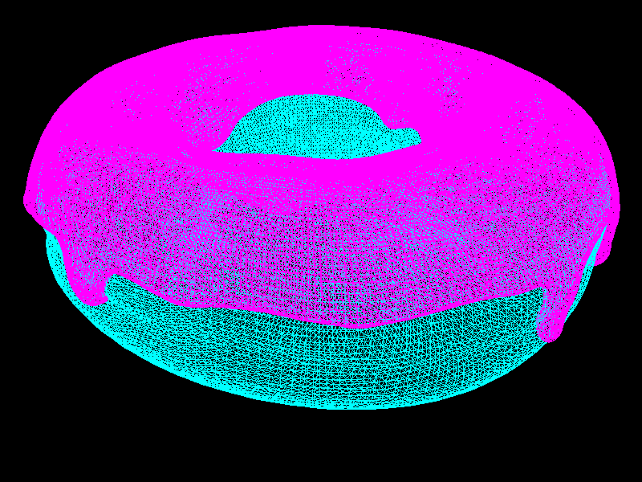
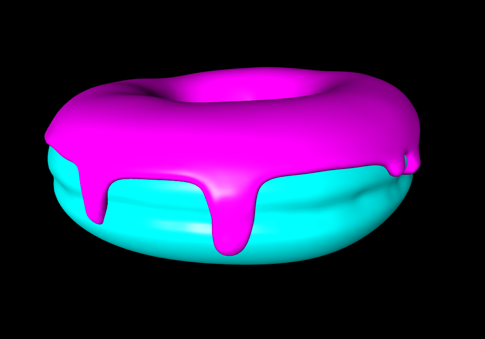
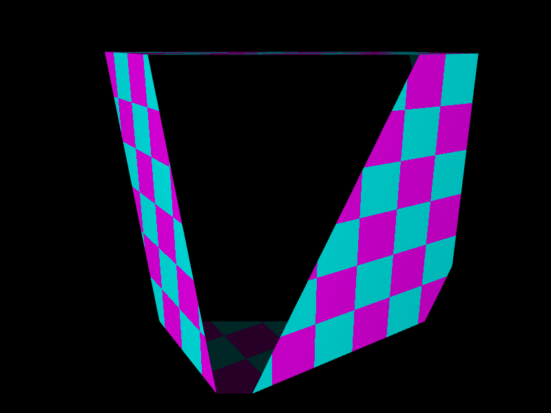
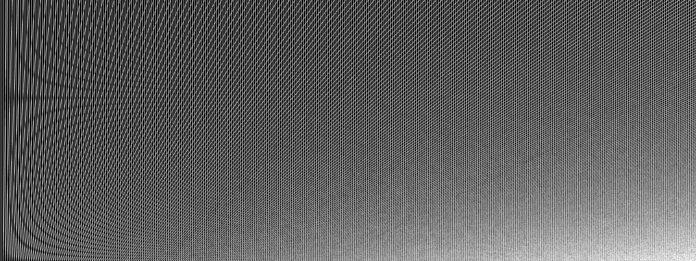
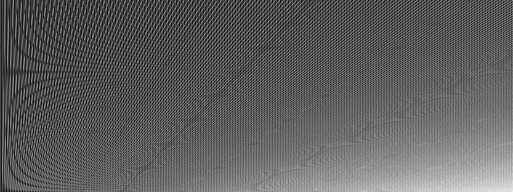

# About

This is a software rasterizer written in Rust that I wrote as part of my Bachelor thesis. It can rasterize lines and triangles into a buffer that can be displayed or saved into a file. I've tried to keep the interface similar to [wgpu](https://github.com/gfx-rs/wgpu), so it should be familiar to anyone with graphics programming experience. I've also tried to make the graphics pipeline configurable and extensible so that users could implement and use their own vertex/fragment shaders, rasterizers, clippers...

There are no docs other than runnable examples, but I wouldn't recommend using it for anything important anyway. The interface can be a little rough around the edges, so at best, if anyone ever stumbles upon this, it might be useful for unimportant personal projects or to someone writing their own rasterizer.

# Examples

### Line rasterization

### Triangle rasterization

### Triangle clipping

### Stochastic anti-aliasing
Stochastic mode:

Static mode:

To switch between stochastic and static modes, press space.
